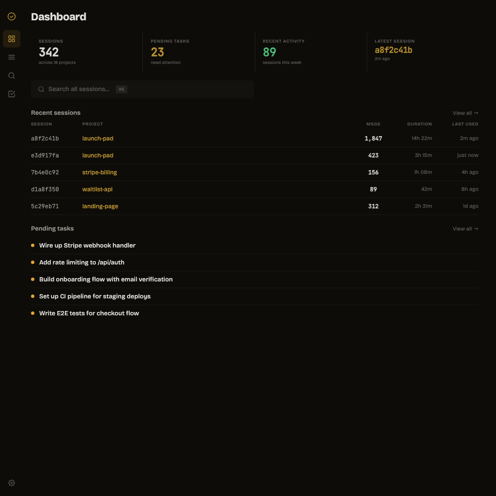

<p align="center">
  
</p>

<h1 align="center">Claude Code Sessions</h1>

<p align="center">
  <strong>Session intelligence for <a href="https://docs.anthropic.com/en/docs/claude-code/overview">Claude Code</a></strong><br>
  Search, analyze, and manage every session across all your projects.
</p>

<p align="center">
  <a href="#install"></a>
  <a href="https://github.com/apappascs/claude-code-sessions/actions/workflows/ci.yml"></a>
  <a href="LICENSE"></a>
  
  
</p>

---

<p align="center">
  
</p>

Claude Code writes a JSONL file for every session you run. These files live in `~/.claude/projects/` and contain everything — messages, tool calls, token counts, diffs, tasks. But there's no built-in way to search or analyze them.

This plugin reads those files and gives you **11 skills** and a **web dashboard** to make sense of your session history.

## Install

### Claude Code (via Plugin Marketplace)

Register the marketplace, then install:

```bash
/plugin marketplace add apappascs/claude-code-sessions
/plugin install claude-code-sessions@claude-code-sessions
```

That's it. No API keys, no config, no runtime dependencies. Most operations are read-only; the delete and cleanup skills can remove session files when explicitly invoked.

## What You Get

### Skills

Use these directly in Claude Code:

| Command | Description |
|---------|-------------|
| `/session-list` | List all sessions, sorted by recency, size, or duration |
| `/session-search "query"` | Full-text search across every session |
| `/session-stats` | Token usage, model distribution, tool breakdown |
| `/session-detail` | Deep dive into a specific session |
| `/session-diff` | Compare two sessions — files, tools, topics |
| `/session-timeline` | Chronological view of all sessions on a project |
| `/session-resume` | Generate a context recovery prompt from any session |
| `/session-tasks` | Find pending and orphaned tasks across sessions |
| `/session-export` | Export a session as clean markdown |
| `/session-cleanup` | Find empty, tiny, or stale sessions |
| `/session-delete` | Delete sessions and their associated tasks |

### Web Dashboard

A local web UI for browsing sessions visually:

```bash
bun run ui
# → http://localhost:3000
```

**4 views:**

- **Dashboard** — session count, pending tasks, recent activity, quick navigation
- **Sessions** — sortable table with project, duration, messages, size. Bulk select and delete
- **Search** — full-text search with context snippets and session linking
- **Tasks** — grouped by status (in progress / pending / completed), orphan detection

**Session detail** — click any session to see its full transcript, tool usage breakdown, token consumption bar, and task lists. Filter tool calls in/out. Paginated message loading.

**Keyboard shortcut:** `Cmd+K` jumps to search from anywhere.

## Architecture

Three TypeScript modules, one HTTP server, zero runtime dependencies:

```
lib/
├── formatters.ts        # JSON serialization, truncation, timestamp parsing
├── session-parser.ts    # Single-session JSONL parser (stats, messages, tools, diffs)
└── session-store.ts     # Cross-session operations (list, search, filter, aggregate)

ui/
├── server.ts            # Bun HTTP server — 10 REST endpoints + static files
└── public/              # Alpine.js SPA, OKLCH design tokens, light/dark theme

skills/                  # Skill definitions
tests/                   # Bun test runner, fixture-based
```

**Data flow:** Claude Code writes JSONL → this plugin reads it. Nothing is modified. Tasks come from `~/.claude/tasks/` with JSONL fallback for older sessions.

Each lib file doubles as a CLI:

```bash
bun run lib/session-store.ts list --sort recency --limit 10
bun run lib/session-store.ts search "database migration" --since 2025-01-01
bun run lib/session-store.ts tasks --status pending
bun run lib/session-parser.ts stats path/to/session.jsonl
bun run lib/session-parser.ts export path/to/session.jsonl --format md
```

## Development

**Prerequisites:** [Bun](https://bun.sh) v1.3+

```bash
# Install
bun install

# Run tests
bun test

# Typecheck
bun run typecheck

# Lint (Biome)
bun run lint

# Start the UI
bun run ui
```

### API Endpoints

| Method | Endpoint | Description |
|--------|----------|-------------|
| GET | `/api/sessions` | List sessions with sort/filter/limit |
| GET | `/api/sessions/stats` | Stats for a single session |
| GET | `/api/sessions/:id` | Full session detail |
| GET | `/api/sessions/:id/messages` | Paginated messages with tool filter |
| DELETE | `/api/sessions/:id` | Delete session file (+ optional tasks) |
| GET | `/api/search` | Full-text search with context |
| GET | `/api/tasks` | Aggregated tasks across sessions |
| GET | `/api/tasks/lists` | All task lists |
| GET | `/api/tasks/orphans` | Orphaned task lists |
| GET | `/api/dashboard/stats` | Dashboard summary stats |
| DELETE | `/api/tasks/:listId/:taskId` | Delete a specific task |
| DELETE | `/api/tasks/:listId` | Delete an entire task list |

## License

[MIT](LICENSE)
